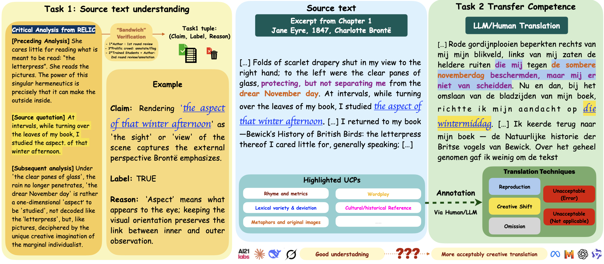

# Beyond-Reproduction <br><sub><sup>A Paired-Task Framework for Assessing LLM Comprehension and Creativity in Literary Translation</sup></sub>

[](to be updated)

## 📁 Repository Structure
```
beyond_imitation/
├── prompt_openrouter.py      # fast API call for efficient and scalable generation and evaluation
├── model_list_full.txt       # Evaluated model list
├── task1/                    # Claim-evaluation benchmark
│   ├── dataset/              # task 1 dataset/task 1 adversarial dataset (to prevent data contamination, please download separately; See instructions below)
│   ├── step1_task1_prompt_gen.py # generate prompt
│   ├── step2_task1_batch_run.py  # batch evaluation of models
│   ├── utils.py              # JSON/text helpers for notebooks
│   └── *.ipynb               # Result analysis and plots generation for results reproducibility
└── task2/                    # Translational creativity benchmark
    ├── dataset/              # task 2 dataset (annotated En-Zh/En-Nl parallel corpus)
    ├── step1_task2_TransPrompt_gen.py
    ├── step2_batch_task2_translation.py   
    ├── task2_evaluator.py
    ├── task2_bench/          # Generated prompts and model outputs
    └── *.ipynb               # Auto-eval and human-eval analysis
```

---

## 🚀 Usage

- **Two benchmark tasks**:
  - Task 1 model benchmark and adversarial test, see [task1](task1/)
  - Task 2 analysis of human annotation and automatic annotation, see [task2](task2/)
 
- Instructions to run translation generation and evaluation with the shared runner
- All experiments use a unified interface (we also upload batch run .py for each separate task):
```bash
# Step1: Build prompts from datasets
for task 1: step1_task1_prompt_gen.py
for task 2: step1_task2_TransPrompt_gen.py

python prompt_openrouter.py \
  --file path/to/prompt.csv \
  --model anthropic/claude-3.7-sonnet:thinking \
  --temperature 0.3 \ (for Task 1 benchmark: 0.3 for less randomness and literary reasoning; for task 2 auto-annotation: 0 for reproducibility; for task 2 literary translation: 0.7)
  --content-column prompt \
  --output-dir path/to/output.csv

Key arguments:
--file: input CSV with prompts
--model: OpenRouter model ID
--content-column: column sent as input
--temperature: sampling temperature
--output-dir: output location
```

- **Instructions to reproduce results** in Task 1 and 2, see .ipynb in Task 1 and Task 2 folders.
- **To download annotated datasets** upon agreeing on the following conditions: 

## 📊 Results Overview


## 🤝 Contributing

Feel free to contribute by submitting a pull request.

```bash
# Fork the repository
# Create a new branch for your feature or fix
# Commit your changes with a clear message
# Push to your fork and submit a PR
```

---

## 📜 License

Specify the license under which this code is shared.

> This project is licensed under the CC License - see the [LICENSE](LICENSE) file for details.

---

## 📖 Citation

If you use this work in your research, please cite it as:

```bibtex
to be updated
```

---
